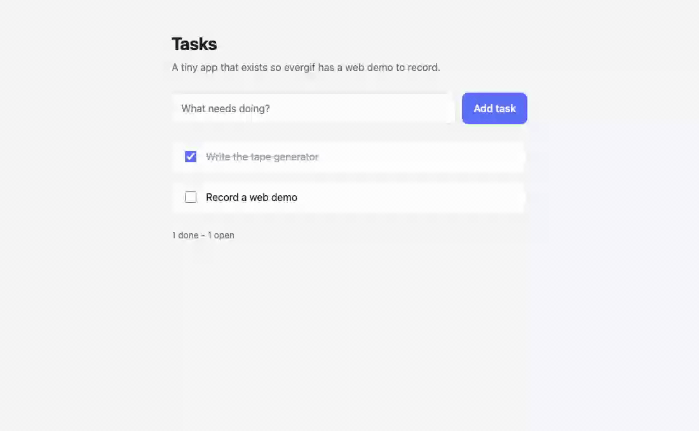

# evergif

**Your README demo that never goes stale.**

evergif is an [Agent Skill](https://agentskills.io) that records a terminal
demo GIF for your CLI, embeds it in your README, and re-renders it in CI so it
never drifts from what your tool actually does. It works in any coding agent
that supports the open Agent Skills standard.

<!-- evergif:start -->

<!-- evergif:end -->

Ask your agent to *"add a demo gif to my README"* and it will inspect the
project, pick the commands worth showing, write a `vhs` tape, render and
optimize the GIF, and embed it between markers it can update later.

## Install

One line, any agent:

```bash
npx skills add https://github.com/ShreyasDasari/evergif --skill evergif
```

Add `-g` to install it globally instead of in the current project.

<details>
<summary>Claude Code plugin</summary>

```
/plugin marketplace add ShreyasDasari/evergif
/plugin install evergif@evergif
```

</details>

<details>
<summary>Manual install (no installer)</summary>

Clone the repo, then symlink the canonical skill into your agent's directory.
`~/.agents/skills/` is read by most agents:

```bash
git clone https://github.com/ShreyasDasari/evergif.git
ln -s "$PWD/evergif/skills/evergif" ~/.agents/skills/evergif   # most agents
ln -s "$PWD/evergif/skills/evergif" ~/.claude/skills/evergif   # Claude Code, Cline
ln -s "$PWD/evergif/skills/evergif" ~/.gemini/skills/evergif   # Gemini CLI
```

On Windows, symlinks need `git clone -c core.symlinks=true` plus Developer
Mode. Without them, copy the folder instead (`xcopy /E /I`), or use
`npx skills add ... --copy`.

</details>

<details>
<summary>Agents without skill support</summary>

Add this to your `AGENTS.md`, `CLAUDE.md`, or custom instructions:

```markdown
## evergif

When asked to add, record, or refresh a demo GIF for this project's README,
read `skills/evergif/SKILL.md` and follow it exactly.
```

</details>

## Supported agents

This repo exposes the skill at every agent's standard discovery path through
three symlinks, so cloning it is enough for any of these to find it.

| Agent | Install | Project discovery path | Status |
|---|---|---|---|
| Claude Code | plugin, `npx skills`, or manual | `.claude/skills/` | **Tested end to end** |
| Gemini CLI | `npx skills`, or manual | `.gemini/skills/` (see note) | **Tested end to end** |
| Codex CLI | `npx skills add -a codex` | `.agents/skills/` | Verified from docs |
| GitHub Copilot | `npx skills`, or manual | `.github/skills/`, `.claude/skills/`, `.agents/skills/` | Verified from docs |
| Cursor | `npx skills add -a cursor` | `.agents/skills/`, `.cursor/skills/` | Install tested |
| OpenCode | `npx skills add -a opencode` | `.agents/skills/`, `.claude/skills/`, `.opencode/skills/` | Install tested |
| Windsurf (Devin Desktop) | manual | `.agents/skills/`, `.windsurf/skills/` | Verified from docs |
| Cline | manual | `.claude/skills/`, `.cline/skills/` | Verified from docs |
| Goose | manual | `.agents/skills/`, `.goose/skills/` | Verified from docs |
| Amp | manual | `.agents/skills/`, `.claude/skills/` | Verified from docs |
| Antigravity | manual | `.agents/skills/` | Verified from docs |

**Tested end to end** means the skill was installed, discovered, and run to a
finished GIF in that agent on a real project. *Install tested* means
`npx skills add` placed it at the documented path, but that agent was not
installed here to run it. *Verified from docs* means the path comes from that
agent's official documentation and nothing else.

> **Note on Gemini CLI:** its docs list `.agents/skills/` as an alias, but
> Gemini CLI 0.27.0 did not discover the skill there in testing — only
> `.gemini/skills/` worked. That is why this repo carries a third symlink.
> If a later version reads `.agents/skills/`, the extra link is harmless.

Global paths differ per agent; `~/.agents/skills/` covers most of the list.
Claude Code and Cline read `~/.claude/skills/` (Cline also `~/.cline/skills/`),
and Gemini CLI reads `~/.gemini/skills/`.

## Usage

Ask in plain language — *"run evergif"*, *"record a terminal demo"*, *"update
the README gif"* — or use the options:

| Option | What it does | Default |
|---|---|---|
| `--commands "a; b"` | Record exactly these commands (1–3) | the agent picks them |
| `--name NAME` | Which demo to write, so one README can hold several | `evergif` |
| `--theme NAME` | Any theme from `vhs themes` | `Catppuccin Mocha` |
| `--ci` | Also add `.github/workflows/evergif.yml` | off |

What you get:

```
demo/evergif.tape     the vhs script, committed so renders are reproducible
demo/evergif.gif      under 2 MB where possible, never over 5 MB
demo/evergif.lock     hash of the recorded output, for the CI freshness check
README.md             an embed between <!-- evergif:start --> / <!-- evergif:end -->
```

Re-running evergif updates the marker block in place. It never adds a second one.

### Web apps

evergif records browser demos too, with Playwright instead of vhs. Point it at
your dev server and describe the steps; it starts the app, records, and writes
the same kind of committed, reviewable script:

```bash
evergif --web --url http://localhost:3000 --serve "npm run dev" \
  --steps "goto /; fill #title Buy milk; click #add; wait li:nth-child(3)"
```

<!-- evergif:start:webapp -->

<!-- evergif:end:webapp -->


That GIF is `examples/webapp`, recorded by evergif's own CI on every run. Web
demos are localhost-only by default and refuse to record credentials, so a
login flow can never end up in your README.

### More than one demo

Ask for a demo of a specific feature and it becomes its own named demo:
*"add a gif showing the install flow"* writes `demo/install.tape`,
`demo/install.gif`, and its own marker pair:

```
<!-- evergif:start:install -->

<!-- evergif:end:install -->
```

Each demo carries its own lock file, so CI re-renders **only** the demos whose
output actually changed, not all of them.

### Zero setup

evergif checks for `vhs`, `ttyd`, `ffmpeg` and `gifsicle`. If any are missing
it falls back to the official `ghcr.io/charmbracelet/vhs` Docker image. Only
when Docker is unavailable too does it stop and print the exact install
command for your OS.

In CI nothing is assumed either: the workflows install a pinned vhs, ttyd and
ffmpeg themselves and run on a pinned `ubuntu-24.04` image, so a runner update
cannot silently change how your GIFs look.

### Safety

Recorded commands are checked in code, not just in the prompt. evergif refuses
to record anything destructive, networked, privileged, interactive, or
non-deterministic, and anything that could print environment variables,
credentials, or paths inside your home directory. It records `--help`,
`--version`, `--dry-run`, and runs against sample data already in your repo.

## How freshness works

With `--ci`, evergif adds a workflow that runs on every push to your default
branch, weekly, and on demand. For each demo it re-runs the exact commands that
demo shows and hashes their output. If the output is byte-identical to the hash
in `demo/<name>.lock`, that GIF is still accurate and nothing is rendered. Only
the demos whose output changed are re-rendered, and they land in one pull
request together.

Comparing output rather than pixels is deliberate. Terminal recordings are not
frame-identical between runs (capture timing jitters by a frame or two), so a
pixel or frame comparison would open a pull request every single week. The
command output only changes when your CLI actually changes, which is the thing
you want to hear about.

Because the PR always targets the same `evergif/update` branch, repeated
changes update one pull request instead of piling up. The first run after you
add the workflow creates `demo/evergif.lock`, so expect one PR to start with.

The workflow needs **Settings → Actions → General → Allow GitHub Actions to
create and approve pull requests**.

## Rendering in the cloud

`--ci` also adds `evergif-render.yml`, so nobody needs a local toolchain to
change a demo. Edit `demo/<name>.tape`, open a pull request, and CI renders the
GIF and pushes it back onto your branch. You can also trigger it by hand from
the Actions tab for one demo or all of them.

Pull requests **from forks** get the rendered GIFs as a downloadable artifact
instead of a push. That is deliberate: a tape is executable content, so
rendering it with a write token and repository secrets — which is what
`pull_request_target` would do — would hand any stranger who opens a pull
request the keys to the repo. evergif never uses `pull_request_target`.

## Contributing

```bash
python3 -m unittest discover -s tests -v
```

23 tests cover the parts where a mistake is expensive: the safety policies that
decide what may be recorded, and the README editing that runs against other
people's files. CI runs them on Python 3.10 and 3.13, lints every generated
workflow with actionlint, and re-renders both demos on every push.

## What's in this repo

```
skills/evergif/SKILL.md        the canonical skill; everything else points here
skills/evergif/scripts/        doctor, inspect, tape, render, web_tape, render_web, embed, ci
skills/evergif/references/     tape cookbook, web demos, optimization, troubleshooting
.claude/skills/evergif    ->   ../../skills/evergif
.agents/skills/evergif    ->   ../../skills/evergif
.gemini/skills/evergif    ->   ../../skills/evergif
.claude-plugin/                Claude Code plugin + marketplace manifests
examples/                      two CLI fixtures and one web app, all recorded by CI
tests/                         run with: python3 -m unittest discover -s tests
```

There is exactly one copy of the skill. Every agent path is a symlink to it.

## Roadmap

**v0.2 (current)** — web app demos with Playwright, rendering in the cloud so
contributors need no local toolchain, and several demo GIFs per README.

Planned next:

- Dark and light variants of the same demo, switched by the reader's theme.
- A `--check` mode for pre-commit hooks, failing when a demo is stale.
- Demos of interactive TUIs without hand-writing the tape.

## License

MIT. See [LICENSE](LICENSE).

Built on [vhs](https://github.com/charmbracelet/vhs) and
[vhs-action](https://github.com/charmbracelet/vhs-action) by Charm. Packaging
follows the pattern set by [brag](https://github.com/latent-spaces/brag).
