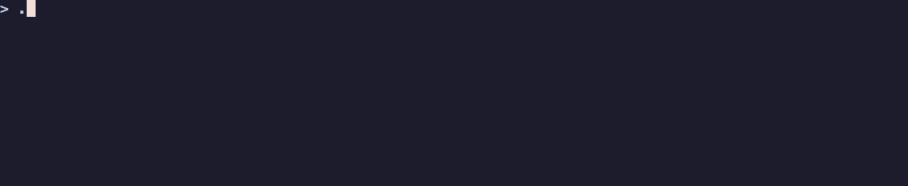

<div align="center">

# evergif

**Your README demo that never goes stale.**

[](https://github.com/ShreyasDasari/evergif/actions/workflows/evergif.yml)
[](https://github.com/ShreyasDasari/evergif/actions/workflows/tests.yml)
[](https://github.com/ShreyasDasari/evergif/releases)
[](https://agentskills.io)
[](LICENSE)

</div>

Every README demo starts out accurate and quietly rots. You rename a flag,
change some output, ship a new screen — and the GIF at the top of your README
keeps showing last quarter's tool.

evergif is an [Agent Skill](https://agentskills.io) that records the demo,
embeds it, and then **re-runs your commands in CI to notice when the GIF stopped
being true.** Ask your agent for a demo; it handles the rest.

<!-- evergif:start -->

<!-- evergif:end -->

```bash
npx skills add https://github.com/ShreyasDasari/evergif --skill evergif
```

Then, in any project: *"add a demo gif to my README"*.

---

## Contents

[What it produces](#what-it-produces) · [Install](#install) ·
[Supported agents](#supported-agents) · [Usage](#usage) ·
[How it stays fresh](#how-it-stays-fresh) · [Rendering in CI](#rendering-in-ci) ·
[Requirements](#requirements) · [Safety](#safety) ·
[Why the GIFs look good](#why-the-gifs-look-good) · [Contributing](#contributing) ·
[Roadmap](#roadmap)

## What it produces

**Terminal demos** with [vhs](https://github.com/charmbracelet/vhs). This is
`examples/shcli`, recorded and kept current by this repository's own CI:



**Web app demos** with [Playwright](https://playwright.dev). This is
`examples/webapp`, recorded the same way:

<!-- evergif:start:webapp -->

<!-- evergif:end:webapp -->

Every demo is a committed artifact — a recording script, a GIF and a lock file —
re-rendered only when what it shows actually changes.

## Install

One line, any agent:

```bash
npx skills add https://github.com/ShreyasDasari/evergif --skill evergif
```

Add `-g` to install globally instead of in the current project.

<details>
<summary><b>Claude Code plugin</b></summary>

```
/plugin marketplace add ShreyasDasari/evergif
/plugin install evergif@evergif
```

</details>

<details>
<summary><b>Manual install</b> (no installer)</summary>

Clone the repository, then symlink the canonical skill into your agent's
directory. `~/.agents/skills/` is read by most agents:

```bash
git clone https://github.com/ShreyasDasari/evergif.git
ln -s "$PWD/evergif/skills/evergif" ~/.agents/skills/evergif   # most agents
ln -s "$PWD/evergif/skills/evergif" ~/.claude/skills/evergif   # Claude Code, Cline
ln -s "$PWD/evergif/skills/evergif" ~/.gemini/skills/evergif   # Gemini CLI
```

On Windows, symlinks need `git clone -c core.symlinks=true` plus Developer
Mode. Without them, copy the folder instead (`xcopy /E /I`), or install with
`npx skills add … --copy`.

</details>

<details>
<summary><b>Agents without skill support</b></summary>

Add this to your `AGENTS.md`, `CLAUDE.md`, or custom instructions:

```markdown
## evergif

When asked to add, record, or refresh a demo GIF for this project's README,
read `skills/evergif/SKILL.md` and follow it exactly.
```

</details>

## Supported agents

This repository exposes the skill at every agent's standard discovery path
through three symlinks, so cloning it is enough for any of these to find it.

| Agent | Install | Project discovery path | Status |
|---|---|---|---|
| Claude Code | plugin, `npx skills`, or manual | `.claude/skills/` | **Tested end to end** |
| Gemini CLI | `npx skills`, or manual | `.gemini/skills/` (see note) | **Tested end to end** |
| Codex CLI | `npx skills add -a codex` | `.agents/skills/` | Verified from docs |
| GitHub Copilot | `npx skills`, or manual | `.github/skills/`, `.claude/skills/`, `.agents/skills/` | Verified from docs |
| Cursor | `npx skills add -a cursor` | `.agents/skills/`, `.cursor/skills/` | Install tested |
| OpenCode | `npx skills add -a opencode` | `.agents/skills/`, `.claude/skills/`, `.opencode/skills/` | Install tested |
| Windsurf (Devin Desktop) | manual | `.agents/skills/`, `.windsurf/skills/` | Verified from docs |
| Cline | manual | `.claude/skills/`, `.cline/skills/` | Verified from docs |
| Goose | manual | `.agents/skills/`, `.goose/skills/` | Verified from docs |
| Amp | manual | `.agents/skills/`, `.claude/skills/` | Verified from docs |
| Antigravity | manual | `.agents/skills/` | Verified from docs |

**Tested end to end** — installed, discovered, and run to a finished GIF in that
agent on a real project. *Install tested* — `npx skills add` placed it at the
documented path, but that agent was not available here to run it. *Verified from
docs* — the path comes from that agent's official documentation and nothing else.

> [!NOTE]
> **Gemini CLI** documents `.agents/skills/` as an alias, but version 0.27.0 did
> not discover the skill there in testing; only `.gemini/skills/` worked. That is
> why this repository carries a third symlink. If a later version reads
> `.agents/skills/`, the extra link is harmless.

Global paths differ per agent. `~/.agents/skills/` covers most of the list;
Claude Code and Cline read `~/.claude/skills/` (Cline also `~/.cline/skills/`),
and Gemini CLI reads `~/.gemini/skills/`.

## Usage

Ask in plain language — *"run evergif"*, *"record a terminal demo"*, *"update the
README gif"* — or steer it with options:

| Option | What it does | Default |
|---|---|---|
| `--commands "a; b"` | Record exactly these commands (1–3) | the agent picks them |
| `--name NAME` | Which demo to write, so one README can hold several | `evergif` |
| `--web` | Record a web app with Playwright instead of a terminal | off |
| `--theme NAME` | Any theme from `vhs themes` | `Catppuccin Mocha` |
| `--ci` | Add the GitHub workflows that keep demos fresh | off |

What lands in your repository:

```
demo/evergif.tape     the vhs script, committed so renders are reproducible
demo/evergif.gif      under 2 MB where possible, never over 5 MB
demo/evergif.lock     what the demo showed, for the CI freshness check
README.md             an embed between <!-- evergif:start --> / <!-- evergif:end -->
```

Re-running evergif updates that block in place. It never adds a second one.

### Web apps

Point it at your dev server and describe the steps. evergif starts the app,
waits for the port, records, stops the server, and converts the video — writing
the same kind of committed, reviewable script:

```bash
evergif --web --url http://localhost:5173 --serve "npm run dev" \
  --steps "goto /; wait #counter; click #counter; pause 700"
```

Verified against a stock Vite dev server and a static site. Freshness is
measured on the page's **visible text**, so restyling a button does not churn
your GIF, but renaming it does.

### More than one demo

Ask for a demo of a specific feature and it becomes its own named demo.
*"Add a gif showing the install flow"* writes `demo/install.tape`,
`demo/install.gif`, and its own marker pair:

```
<!-- evergif:start:install -->

<!-- evergif:end:install -->
```

Each demo carries its own lock file, so CI re-renders **only** the demos that
actually changed — not all of them.

## How it stays fresh

With `--ci`, evergif adds a workflow that runs on every push to your default
branch, weekly, and on demand. For each demo it re-runs the exact commands that
demo shows and hashes their output together with the recording script. If that
hash matches `demo/<name>.lock`, the GIF is still accurate and **nothing is
rendered**. Only demos that changed are re-rendered.

Comparing output rather than pixels is deliberate: terminal recordings are not
frame-identical between runs — capture timing jitters by a frame or two — so a
pixel comparison would raise a change every single week. Command output changes
only when your CLI does, which is the thing worth hearing about. Hashing the
script alongside it means a new theme, size or pacing re-renders too.

Refreshed GIFs are **committed straight to the branch**, which works with a
repository's default permissions — there is no setting to enable and nothing to
approve. If the branch is protected, the workflow pushes to `evergif/update`
and prints a compare link in the job summary.

Prefer review? `--ci --pr` opens a pull request instead. That path needs
**Settings → Actions → General → Allow GitHub Actions to create and approve pull
requests**, which is off by default.

## Rendering in CI

`--ci` also adds `evergif-render.yml`, so nobody needs a local toolchain to
change a demo. Edit `demo/<name>.tape`, open a pull request, and CI renders the
GIF and pushes it back onto your branch. You can also trigger it by hand from
the Actions tab, for one demo or all of them.

Pull requests **from forks** receive the rendered GIFs as a downloadable
artifact instead of a push. That is deliberate: a tape is executable content, so
rendering it with a write token and repository secrets — which is what
`pull_request_target` does — would hand anyone who opens a pull request the keys
to the repository. evergif never uses `pull_request_target`.

## Requirements

Terminal demos need `vhs`, plus `ttyd` and `ffmpeg`. On macOS that is one line:

```bash
brew install vhs gifsicle
```

evergif checks before it starts and prints the exact command for your OS rather
than failing halfway through.

Web demos need nothing but Node: Playwright and its browser are fetched into
evergif's own cache, never into your project. On a Linux host with no Node at
all, `--docker` records with the official Playwright image instead.

CI assumes nothing either. The workflows install pinned versions of vhs, ttyd
and ffmpeg themselves and run on a pinned `ubuntu-24.04` image, so a runner
update cannot silently change how your GIFs look.

## Safety

Recorded commands are checked **in code**, not just in the prompt. evergif
refuses to record anything destructive, networked, privileged, interactive or
non-deterministic, along with anything that could print environment variables,
credentials, or paths inside your home directory. It records `--help`,
`--version`, `--dry-run`, and runs against sample data already in your repository.

Web demos are localhost-only unless you explicitly say otherwise, and steps
mentioning passwords, tokens or API keys are refused outright — a login flow
cannot end up in your README.

## Why the GIFs look good

A demo that is illegible is worse than no demo, so evergif treats quality as a
feature:

- **Recorded at display size.** GitHub renders a README about 890px wide, so
  demos default to 1100px and are never downscaled. Shrinking a UI recording
  softens every label in it.
- **Colours given up last.** A crushed palette is what bands gradients and
  fringes small text, so optimization spends lossy compression first and holds
  256 colours as long as the size budget allows.
- **Lossless when it fits.** Both locally and in CI, optimization starts
  lossless and steps down only while over budget, applying each level to the
  pristine render rather than stacking them.
- **Deterministic by construction.** A fixed shell, prompt, font and viewport,
  with reduced motion for web demos, so a re-render differs only when the
  content does.

## Contributing

```bash
python3 -m unittest discover -s tests -v
```

23 tests cover the places where a mistake is expensive: the safety policies that
decide what may be recorded, and the README editing that runs against other
people's files. CI runs them on Python 3.10 and 3.13, lints every generated
workflow with actionlint **and** shellcheck, re-renders this repository's own
demos in `demo/` on every push, and verifies the Docker path for web demos on a
Linux runner.

### What's in this repository

```
skills/evergif/SKILL.md        the canonical skill; everything else points here
skills/evergif/scripts/        doctor, inspect, tape, render, web_tape, render_web, embed, ci
skills/evergif/references/     tape cookbook, web demos, optimization, troubleshooting
.claude/skills/evergif    ->   ../../skills/evergif
.agents/skills/evergif    ->   ../../skills/evergif
.gemini/skills/evergif    ->   ../../skills/evergif
.claude-plugin/                Claude Code plugin + marketplace manifests
examples/                      two CLI fixtures and one web app, all recorded by CI
tests/                         python3 -m unittest discover -s tests
```

There is exactly one copy of the skill. Every agent path is a symlink to it.

## Roadmap

**v0.4 — current.** Terminal and web demos, several demos per README, rendering
in CI for contributors with no local toolchain, freshness that re-renders only
what changed, and full-quality GIFs at display resolution.

Planned next:

- Dark and light variants of the same demo, switched by the reader's theme.
- A `--check` mode for pre-commit hooks, failing when a demo is stale.
- Demos of interactive TUIs without hand-writing the tape.

## License

MIT — see [LICENSE](LICENSE).

Built on [vhs](https://github.com/charmbracelet/vhs) by Charm and
[Playwright](https://playwright.dev) by Microsoft. Packaging follows the pattern
set by [brag](https://github.com/latent-spaces/brag).
